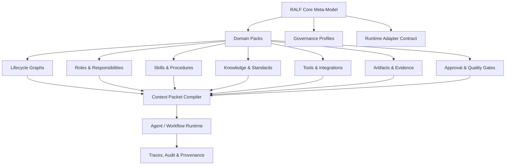

<div align="center">

# RALF Framework

### Structure your organization before you automate it.

**RALF** is an open framework for modeling organizational lifecycles, roles, knowledge, workflows, artifacts, governance gates, and AI-ready task context.

It helps teams turn real-world domain expertise into structured, reusable operating models that humans, software systems, and AI agents can safely work with.

[](#project-status)
[](#what-is-ralf)
[](#why-ralf)
[](#license)

</div>

---

## What is RALF?

**RALF** stands for **Role-Agent Lifecycle Framework**.

RALF is not another chatbot, workflow engine, or agent runtime. It is a framework for describing how work should happen inside an organization before automation is introduced.

A RALF model connects:

- **Lifecycles** — the phases of work from start to finish
- **Domains** — the business or technical areas involved
- **Roles** — who is responsible, accountable, consulted, or informed
- **Agents** — human or AI executors operating within bounded responsibilities
- **Skills** — reusable procedures for performing tasks
- **Knowledge** — policies, standards, domain facts, examples, and lessons learned
- **Tools** — systems, APIs, data sources, and integrations
- **Artifacts** — evidence, documents, outputs, records, and decisions
- **Gates** — approvals, validations, controls, and quality checks
- **Traces** — audit history of what happened, why, and by whom

The goal is simple:

> Make organizational knowledge structured enough to be reused, governed, automated, and safely supported by AI.

---

## Why RALF?

Many organizations want to use AI, but their internal context is often scattered across documents, tools, meetings, experts, and undocumented habits.

This creates a common failure pattern:

```text
Unclear lifecycle → unclear ownership → weak context → unreliable automation → low trust
```

RALF starts from the opposite direction:

```text
Lifecycle → roles → knowledge → artifacts → gates → context packets → safe execution
```

RALF helps organizations answer questions like:

- What lifecycle are we trying to improve?
- Which roles are responsible for each phase?
- What knowledge and standards should guide the work?
- What artifacts must be produced or reviewed?
- Which tasks can be assisted by AI?
- Which decisions must remain under human control?
- What evidence do we need for trust, audit, and improvement?

---

## Core idea

A business lifecycle defines **what must happen**.  
Roles define **who is responsible**.  
Skills define **how work is performed**.  
Knowledge defines **what must be known**.  
Tools enable **action**.  
Artifacts preserve **evidence**.  
Gates enforce **control**.  
Traces prove **what happened**.

RALF binds these pieces into reusable domain models and executable context packets.

---

## What RALF is not

RALF is not intended to replace existing systems.

It is not:

- a replacement for BPMN, DMN, RACI, ISO standards, or governance frameworks
- a replacement for agent runtimes such as LangGraph, CrewAI, OpenAI Agents SDK, or other orchestration tools
- a replacement for ERP, MES, PLM, CMMS, CRM, Git, ticketing, or documentation systems
- a generic prompt library
- a chatbot-first automation tool

RALF is a **binding layer** that helps organizations compose existing standards, systems, roles, workflows, and AI capabilities into a coherent operating model.

---

## RALF architecture at a glance



---

## Key concepts

### Domain Pack

A reusable package for a specific domain or operating area.

Examples:

- software development lifecycle
- predictive maintenance
- manufacturing planning
- quality management
- compliance workflows
- service operations
- customer support

A domain pack may include lifecycles, roles, skills, knowledge references, tool definitions, artifact schemas, gates, and example workflows.

### Lifecycle

A structured description of how work moves from beginning to end.

Example:

```text
Request → Triage → Diagnose → Plan → Execute → Validate → Close → Improve
```

### Role

A responsibility model for humans, teams, systems, or agents.

Roles define ownership, permissions, accountabilities, approval rights, and handoff expectations.

### Skill

A repeatable procedure for doing work.

Skills describe the method, inputs, outputs, tools, required knowledge, and quality criteria for a task.

### Artifact

A durable output or evidence record.

Examples include requirements, designs, work orders, test reports, audit records, SOPs, risk reviews, release notes, and decision logs.

### Gate

A control point that checks whether work can continue.

A gate may include human approval, automated validation, policy checks, evidence requirements, risk assessment, or quality criteria.

### Context Packet

A bounded task package compiled from the RALF model.

A context packet gives a human, AI agent, or workflow runtime only the information needed for a specific task:

- task objective
- role binding
- allowed tools
- required knowledge
- input artifacts
- output contract
- constraints
- approval gates
- trace requirements

---

## Who is RALF for?

RALF is designed for people and teams who need to make complex work understandable, governable, and reusable.

### Domain experts

For people who understand the work but do not want to learn AI, software architecture, or process modeling theory.

RALF helps them describe how their organization works using their own domain language.

### Implementation consultants

For people helping organizations map workflows, roles, responsibilities, and operational knowledge.

RALF gives them a reusable structure for workshops, assessments, transformation programs, and AI-readiness projects.

### Technical integrators

For people building automations, agents, workflow tools, or enterprise integrations.

RALF gives them structured schemas, context packets, and runtime adapter patterns.

### Leaders and operators

For people responsible for governance, quality, compliance, delivery, reliability, or operational improvement.

RALF helps clarify ownership, controls, evidence, and improvement loops.

---

## Example use cases

### AI-ready workflow design

Model a workflow before introducing AI assistance, including roles, decision points, required knowledge, and approval gates.

### Lifecycle mapping

Turn a messy process into a clear lifecycle with phases, inputs, outputs, owners, and improvement loops.

### Role and responsibility clarification

Define who owns each part of the work, who approves decisions, and where handoffs occur.

### Domain knowledge structuring

Capture expert knowledge, standards, procedures, examples, and lessons learned in a reusable structure.

### Context packet generation

Compile task-specific context for agents, assistants, or automation systems without exposing unnecessary organizational information.

### Governance and auditability

Track artifacts, approvals, tool usage, decisions, and provenance across automated or AI-assisted work.

---

## Repository roadmap

This organization may contain repositories such as:

| Repository | Purpose |
|---|---|
| `ralf-spec` | Core framework specification and meta-model |
| `ralf-schemas` | JSON/YAML schemas for lifecycles, roles, skills, artifacts, gates, and context packets |
| `ralf-cli` | Local validation, packaging, and inspection tools |
| `ralf-sdk-js` | TypeScript SDK for building RALF-compatible tools |
| `ralf-sdk-py` | Python SDK for automation, validation, and integrations |
| `ralf-domain-packs` | Starter domain packs and examples |
| `ralf-adapters` | Runtime adapter examples for agent and workflow systems |
| `ralf-studio` | Visual modeling environment for building and managing RALF models |
| `ralf-docs` | Documentation, guides, examples, and implementation patterns |

> Repository names and boundaries may change as the framework evolves.

---

## Getting started

RALF is currently in early design. The recommended first steps are:

1. Read the framework overview.
2. Review the core meta-model.
3. Explore an example domain pack.
4. Create a small lifecycle for your own organization or team.
5. Define roles, artifacts, gates, and knowledge sources.
6. Generate or manually write a task context packet.
7. Validate the model with real users before automating anything.

A minimal lifecycle model might look like this:

```yaml
id: maintenance-request-lifecycle
name: Maintenance Request Lifecycle
phases:
  - id: request
    name: Request
    output_artifacts:
      - maintenance_request
  - id: triage
    name: Triage
    owner_role: maintenance_planner
    gates:
      - safety_check
  - id: execute
    name: Execute Work
    owner_role: technician
    output_artifacts:
      - work_log
  - id: close
    name: Close and Learn
    owner_role: maintenance_lead
    output_artifacts:
      - closure_report
```

---

## Design principles

RALF follows a few core principles:

1. **Lifecycle before agents** — understand the work before assigning automation.
2. **Humans remain accountable** — AI can assist, but ownership and risk stay with people and organizations.
3. **Knowledge is first-class** — standards, policies, examples, and lessons learned are part of the model.
4. **Every task produces or transforms artifacts** — outputs should be durable, reviewable, and traceable.
5. **Every high-risk action needs a gate** — approvals and validations must be explicit.
6. **Tools use least privilege** — agents and workflows should only access what they need.
7. **Context is compiled** — each task receives bounded context, not the entire organization.
8. **Runtime adapters are replaceable** — RALF should work across different workflow and agent systems.
9. **Domain packs are reusable** — common operating patterns should be packaged, versioned, and improved.
10. **Traceability builds trust** — decisions, artifacts, approvals, and tool actions should be auditable.

---

## RALF and AI agents

RALF treats agents as bounded executors, not independent owners.

An AI agent may:

- draft an artifact
- summarize evidence
- check a workflow against standards
- propose missing information
- generate a first version of a procedure
- call approved tools
- prepare a recommendation

But high-impact decisions should pass through explicit gates.

RALF is designed to help teams answer:

> What should the agent know, what may it do, what must it produce, and who approves the result?

---

## Project status

RALF is in an early framework and product-design phase.

Current focus areas:

- defining the core meta-model
- creating example domain packs
- designing context packet structures
- exploring governance and provenance patterns
- preparing open-source documentation and schemas
- designing RALF Studio as a visual modeling environment

---

## Contributing

RALF is intended to become a practical, open, and community-friendly framework.

Good contribution areas include:

- lifecycle examples
- domain pack ideas
- schema feedback
- terminology improvements
- governance patterns
- adapter ideas
- documentation improvements
- real-world use cases

Before contributing, please read the project goals and keep the framework focused on clarity, safety, interoperability, and practical adoption.

---

## License

License selection is still being finalized.

The expected direction is:

- permissive open-source licensing for the RALF Core specification, schemas, SDKs, and basic tooling
- separate commercial licensing for hosted products, premium domain packs, enterprise features, and proprietary implementations
- trademark protection for the RALF name, logo, certification marks, and compatibility labels

---

## Long-term vision

RALF aims to become a shared framework for building AI-ready organizations.

The long-term goal is to help teams move from scattered knowledge and unclear ownership to structured, reusable, governed operating models.

```text
Expert knowledge → lifecycle model → roles → skills → artifacts → gates → context packets → safe AI-assisted execution
```

---

<div align="center">

**RALF Framework**  
*Structure your organization before you automate it.*

</div>
