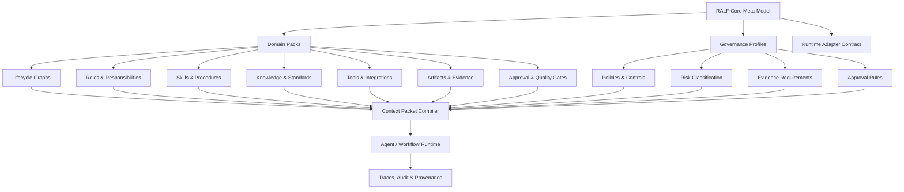

<div align="center">

# Role-Agent Lifecycle Framework

### Structure your organization before you automate it.

**RALF** is an open, early-stage framework for modeling organizational lifecycles, roles, knowledge, workflows, artifacts, governance controls, and AI-ready task context.

It helps teams turn real-world domain expertise into structured, reusable operating models that humans, software systems, and AI agents can work with more safely.

[](#project-status)
[](#what-is-ralf)
[](#why-ralf)
[](#license)

</div>

---

## What is RALF?

**RALF** stands for **Role-Agent Lifecycle Framework**.

RALF is not another chatbot, workflow engine, or agent runtime. It is a framework for describing how work should happen inside an organization before automation is introduced.

A RALF model connects:

- **Lifecycles** — the phases of work from start to finish
- **Domains** — the business, technical, operational, or scientific areas involved
- **Roles** — who is responsible, accountable, consulted, or informed
- **Agents** — human, software, or AI executors operating within bounded responsibilities
- **Skills** — reusable procedures for performing tasks
- **Knowledge** — policies, standards, domain facts, examples, and lessons learned
- **Tools** — systems, APIs, data sources, and integrations
- **Artifacts** — evidence, documents, outputs, records, and decisions
- **Gates** — approvals, validations, controls, and quality checks
- **Governance profiles** — policies, risks, controls, approval rules, and evidence requirements
- **Traces** — audit history of what happened, why, and by whom

The goal is simple:

> Make organizational knowledge structured enough to be reused, governed, automated, and safely supported by AI.

---

## Research and validation status

RALF is currently a **proposed framework** in early research, specification, and product-design stages.

The framework is being developed through:

- a conceptual research paper
- an open specification
- machine-readable schemas
- example domain packs
- validation tooling
- the planned **RALF Studio** visual modeling environment

RALF does **not** claim automatic regulatory compliance. Instead, it provides structures for representing governance controls, roles, approvals, risks, evidence, and runtime constraints.

The next major validation step is to use **RALF Studio** to test whether domain experts and technical teams can model real workflows using RALF concepts.

---

## Why RALF?

Many organizations want to use AI, but their internal context is often scattered across documents, tools, meetings, experts, and undocumented habits.

This creates a common failure pattern:

```text
Unclear lifecycle → unclear ownership → weak context → unreliable automation → low trust
```

RALF starts from the opposite direction:

```text
Lifecycle → roles → knowledge → artifacts → governance → gates → context packets → safe execution
```

RALF helps organizations answer questions like:

- What lifecycle are we trying to improve?
- Which roles are responsible for each phase?
- What knowledge and standards should guide the work?
- What artifacts must be produced or reviewed?
- Which policies and risks apply?
- Which tasks can be assisted by AI?
- Which decisions must remain under human control?
- What evidence do we need for trust, audit, and improvement?

---

## Core idea

A business lifecycle defines **what must happen**.  
Roles define **who is responsible**.  
Skills define **how work is performed**.  
Knowledge defines **what must be known**.  
Tools enable **action**.  
Artifacts preserve **evidence**.  
Governance defines **rules, risks, and controls**.  
Gates enforce **review and approval**.  
Traces prove **what happened**.

RALF binds these pieces into reusable domain models and executable context packets.

---

## Dynamic governance layer

RALF treats governance as a dynamic layer, not as a static checklist.

A RALF governance profile may describe:

- applicable policies, standards, or regulatory references
- risk classifications
- required controls
- approval rules
- evidence requirements
- prohibited or restricted actions
- runtime enforcement expectations
- audit and provenance requirements

This allows governance to be attached to lifecycle phases, roles, artifacts, tools, context packets, and agent actions.

RALF can help structure governance for frameworks such as AI risk management, internal policy, security review, quality management, and regulatory readiness. However, RALF itself does not make a system legally compliant. Compliance depends on correct implementation, organizational process, legal interpretation, human review, and evidence quality.

---

## What RALF is not

RALF is not intended to replace existing systems or standards.

It is not:

- a replacement for BPMN, DMN, RACI, ISO standards, NIST frameworks, or governance frameworks
- a replacement for agent runtimes such as LangGraph, CrewAI, OpenAI Agents SDK, Semantic Kernel, or other orchestration tools
- a replacement for ERP, MES, PLM, CMMS, CRM, Git, ticketing, or documentation systems
- a generic prompt library
- a chatbot-first automation tool
- a legal compliance automation system

RALF is a **binding layer** that helps organizations compose existing standards, systems, roles, workflows, governance controls, and AI capabilities into a coherent operating model.

---

## RALF architecture at a glance



---

## RALF Studio

**RALF Studio** is the planned visual modeling environment for validating and applying the framework.

The goal of Studio is to help users model:

- organizational lifecycles
- roles and responsibilities
- artifacts and evidence
- governance controls
- approval gates
- domain knowledge
- context packets for AI-assisted work

Studio is also intended to validate the framework itself by testing whether real users can apply RALF to practical workflows before broad claims are made about maturity or adoption.

---

## Key concepts

### Domain Pack

A reusable package for a specific domain or operating area.

Examples:

- software development lifecycle
- predictive maintenance
- manufacturing planning
- quality management
- compliance workflows
- service operations
- customer support

A domain pack may include lifecycles, roles, skills, knowledge references, tool definitions, artifact schemas, governance profiles, gates, and example workflows.

### Lifecycle

A structured description of how work moves from beginning to end.

Example:

```text
Request → Triage → Diagnose → Plan → Execute → Validate → Close → Improve
```

### Role

A responsibility model for humans, teams, systems, or agents.

Roles define ownership, permissions, accountabilities, approval rights, and handoff expectations.

### Skill

A repeatable procedure for doing work.

Skills describe the method, inputs, outputs, tools, required knowledge, and quality criteria for a task.

### Artifact

A durable output or evidence record.

Examples include requirements, designs, work orders, test reports, audit records, SOPs, risk reviews, release notes, and decision logs.

### Governance Profile

A versioned governance model that connects policies, risks, controls, approvals, evidence requirements, and runtime constraints.

A governance profile may reference internal policy, security requirements, quality standards, risk frameworks, or regulation-related obligations.

### Gate

A control point that checks whether work can continue.

A gate may include human approval, automated validation, policy checks, evidence requirements, risk assessment, or quality criteria.

### Context Packet

A bounded task package compiled from the RALF model.

A context packet gives a human, AI agent, or workflow runtime only the information needed for a specific task:

- task objective
- role binding
- allowed tools
- required knowledge
- input artifacts
- output contract
- constraints
- governance profile
- approval gates
- trace requirements

---

## Who is RALF for?

RALF is designed for people and teams who need to make complex work understandable, governable, and reusable.

### Domain experts

For people who understand the work but do not want to learn AI, software architecture, or process modeling theory.

RALF helps them describe how their organization works using their own domain language.

### Implementation consultants

For people helping organizations map workflows, roles, responsibilities, governance needs, and operational knowledge.

RALF gives them a reusable structure for workshops, assessments, transformation programs, and AI-readiness projects.

### Technical integrators

For people building automations, agents, workflow tools, or enterprise integrations.

RALF gives them structured schemas, context packets, and runtime adapter patterns.

### Leaders and operators

For people responsible for governance, quality, compliance, delivery, reliability, or operational improvement.

RALF helps clarify ownership, controls, evidence, and improvement loops.

---

## Example use cases

### AI-ready workflow design

Model a workflow before introducing AI assistance, including roles, decision points, required knowledge, governance controls, and approval gates.

### Lifecycle mapping

Turn a messy process into a clear lifecycle with phases, inputs, outputs, owners, and improvement loops.

### Role and responsibility clarification

Define who owns each part of the work, who approves decisions, and where handoffs occur.

### Domain knowledge structuring

Capture expert knowledge, standards, procedures, examples, and lessons learned in a reusable structure.

### Context packet generation

Compile task-specific context for agents, assistants, or automation systems without exposing unnecessary organizational information.

### Governance and auditability

Track policies, risks, approvals, tool usage, decisions, evidence, and provenance across automated or AI-assisted work.

---

## Repository roadmap

This organization may contain repositories such as:

| Repository | Purpose |
|---|---|
| `ralf` | Main framework overview, documentation, examples, and roadmap |
| `ralf-spec` | Core framework specification and meta-model |
| `ralf-schemas` | JSON/YAML schemas for projects, domain packs, policies, artifacts, and context packets |
| `ralf-cli` | Local validation, packaging, and inspection tools |
| `ralf-studio` | Planned visual modeling environment for building and validating RALF models |
| `ralf-domain-packs` | Starter domain packs and examples |
| `ralf-adapters` | Runtime adapter examples for agent and workflow systems |
| `ralf-docs` | Documentation, guides, examples, and implementation patterns |

> Repository names and boundaries may change as the framework evolves.

---

## Getting started

RALF is currently in early design. The recommended first steps are:

1. Read the framework overview.
2. Review the core meta-model.
3. Explore an example domain pack.
4. Create a small lifecycle for your own organization or team.
5. Define roles, artifacts, gates, and knowledge sources.
6. Add governance profiles, policies, risks, and evidence requirements.
7. Generate or manually write a task context packet.
8. Validate the model with real users before automating anything.

A minimal lifecycle model might look like this:

```yaml
id: maintenance-request-lifecycle
name: Maintenance Request Lifecycle

phases:
  - id: request
    name: Request
    output_artifacts:
      - maintenance-request

  - id: triage
    name: Triage
    owner_role: maintenance-planner
    gates:
      - safety-check

  - id: execute
    name: Execute Work
    owner_role: technician
    output_artifacts:
      - work-log

  - id: close
    name: Close and Learn
    owner_role: maintenance-lead
    output_artifacts:
      - closure-report

governance:
  profile: basic-operational-governance
  required_controls:
    - safety-review
    - evidence-record
    - human-approval-for-high-risk-actions
```

---

## Design principles

RALF follows a few core principles:

1. **Lifecycle before agents** — understand the work before assigning automation.
2. **Humans remain accountable** — AI can assist, but ownership and risk stay with people and organizations.
3. **Knowledge is first-class** — standards, policies, examples, and lessons learned are part of the model.
4. **Governance is dynamic** — policies, risks, controls, and evidence requirements should be versioned and adaptable.
5. **Every task produces or transforms artifacts** — outputs should be durable, reviewable, and traceable.
6. **Every high-risk action needs a gate** — approvals and validations must be explicit.
7. **Tools use least privilege** — agents and workflows should only access what they need.
8. **Context is compiled** — each task receives bounded context, not the entire organization.
9. **Runtime adapters are replaceable** — RALF should work across different workflow and agent systems.
10. **Traceability builds trust** — decisions, artifacts, approvals, and tool actions should be auditable.

---

## RALF and AI agents

RALF treats agents as bounded executors, not independent owners.

An AI agent may:

- draft an artifact
- summarize evidence
- check a workflow against standards
- propose missing information
- generate a first version of a procedure
- call approved tools
- prepare a recommendation

But high-impact decisions should pass through explicit gates.

RALF is designed to help teams answer:

> What should the agent know, what may it do, what must it produce, which governance rules apply, and who approves the result?

---

## Project status

RALF is in an early framework and product-design phase.

Current focus areas:

- defining the core meta-model
- updating the governance model
- creating example domain packs
- designing context packet structures
- preparing schemas for validation
- preparing CLI-based validation tools
- designing RALF Studio as a visual modeling environment
- validating the framework with practical workflow examples

Not yet claimed:

- production maturity
- broad industry adoption
- automatic legal or regulatory compliance
- complete runtime enforcement
- validated results across domains

---

## Contributing

RALF is intended to become a practical, open, and community-friendly framework.

Good contribution areas include:

- lifecycle examples
- domain pack ideas
- schema feedback
- terminology improvements
- governance patterns
- adapter ideas
- documentation improvements
- real-world validation cases

Before contributing, please keep the framework focused on clarity, safety, interoperability, governance, and practical adoption.

---

## License

License selection is still being finalized.

The expected direction is:

- permissive open-source licensing for the RALF Core specification, schemas, SDKs, and basic tooling
- separate commercial licensing for hosted products, premium domain packs, enterprise features, and proprietary implementations
- trademark protection for the RALF name, logo, certification marks, and compatibility labels

---

## Long-term vision

RALF aims to become a shared framework for building AI-ready, governed organizations.

The long-term goal is to help teams move from scattered knowledge and unclear ownership to structured, reusable, governed operating models.

```text
Expert knowledge
→ lifecycle model
→ roles
→ skills
→ artifacts
→ governance
→ gates
→ context packets
→ safe AI-assisted execution
```

---

<div align="center">

**RALF Framework**  
*Structure your organization before you automate it.*

</div>
